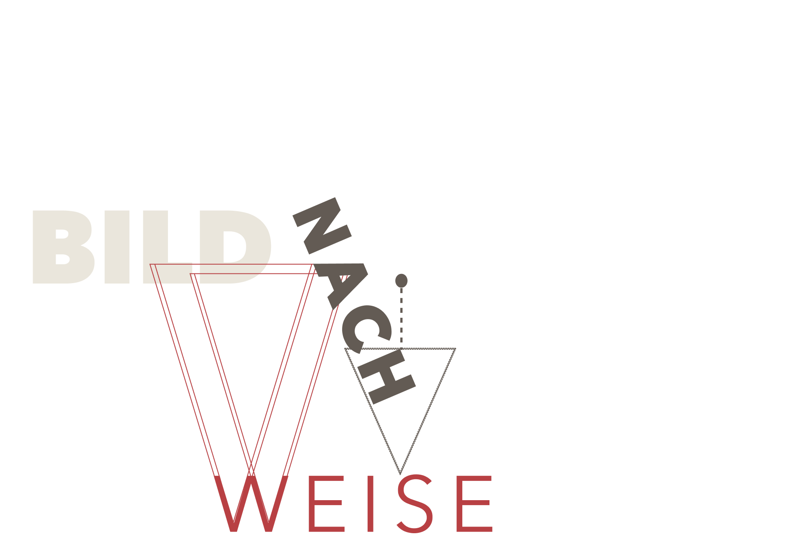

# »Mit dem roten Keil schlage die Weißen«

Das Plakat „Mit dem roten Keil schlage die Weißen“ (Original auf russisch: „Клином красным бей белых“) von El Lissitzky aus dem Jahr 1920 ist ein Propagandaplakat für die rote Armee zu Zeiten der politischen Umstrukturierung und des Bürgerkriegs in Russland nach der Oktoberrevolution. Es entstand in Witebsk, damals Russland – heute Weißrussland – und hat dessen Titel von dem Schriftzug, welcher sich auf dem Plakat befindet, übernommen.

### Leitfaden
Der Leitfaden meiner Narration ist der Aufsatz von Prof. Dr. Verena Krieger 
„El Lissitzkys "Roter Keil" - 4 Kontexte und 3 Bildlektüren.  Die Semantik der Form in Ikonologischer Perspektive“ (2015). [&lbrack;1&rbrack;](#quellen) 

Darin stellt sie zu Beginn die Ausgangsfrage in den Raum, warum dieses Werk von der Kunsthistorik so wenig erforscht sei und zeigt mit ihrer Narration die Vielseitigkeit und Komplexität dieses Werks auf.

 Ich baue meine Auseinandersetzung prinzipiell auf ihre Argumentation auf, während sie jedoch versucht, die Komplexität des Plakats zu belegen, nehme ich in meiner Narration diesen Fakt bereits als gegeben an und beschäftige mich stattdessen mit der Frage nach der Dualität des „Roten Keils“, welche sich durch die verschiedenen Deutungen wie ein roter Faden durchzieht.

Was damit gemeint ist, erkläre ich im Folgenden.

---

## Dualität von Krieg & Kunst

„Mit dem roten Keil schlage die Weißen“ stellt auf vielen Ebenen einen Zustand der Ambivalenz dar!

Ob in der Komposition, welche sich konsequent in Form, Farbe und Kontrast einer Zweiteilung bedient, oder in der Darstellung der polarisierten Bevölkerung im Bürgerkrieg, welche sich lediglich als eine fragmentierte Gesellschaft zwischen den Fronten begegnet. 

### Ausgangsfrage
Wie es die Ironie so will, ist auch das Werk selber genau in der Position gelandet, die es abbildet, nämlich in einem Zustand der Zerrissenheit, jedoch in einem anderen Kontext, als man vielleicht annehmen mag. 

Gemeint ist der kunsthistorische Diskurs um das Werk, oder besser gesagt, der Mangel an diesem. Obwohl sich der „Rote Keil“, sowohl in der Erforschung politischer Plakatkunst, als auch im kunsthistorischen Raum, einer durchaus großen Bekanntheit erfreut, sieht sich keine dieser Disziplinen für die Erforschung dieses Plakats zuständig. 

So scheint die Propagandaforschung das Fehlen einer gegenständlichen Ikonographie, was sich im politischen Plakat nicht durchgesetzt hatte, als Ausschlusskriterium für einen potentiellen Forschungswert anzusehen, während die Kunsthistorik die offensichtliche Lesbarkeit der Aussage als Qualitätsmangel im künstlerischen Wert belächelt. Währenddessen findet sich der „Rote Keil“ erneut im Zentrum des Konflikts ein, bei welchem von beiden Parteien leider mal wieder nur in schwarz-weiß gedacht wird.

Dabei ist gerade das Zusammenwirken von Abstraktion und Kommunikation – Propagandaplakat und Kunstwerk – so spannend in der Fragestellung nach der Semantik der gegenstandslosen Formsprache und der Erforschung diverser kultureller und wahrnehmungspsychologischer Einflüsse.

### Mein roter Faden
Ich stellte mir die Frage, ob sich neben dem Offensichtlichen auch andere Formen der Dualität in den Deutungen finden lassen, was im Folgenden auch zum zentralen Punkt meiner Auseinandersetzung wird.

---

# Kultureller Kontext
Bevor ich in die tatsächliche Bildanalyse gehe, ist es wichtig, einen grundlegenden historischen, politischen und künstlerischen Kontext zu etablieren, sowohl zur russischen Gesellschaft zur damaligen Zeit, als auch zu Lissitzky und seinem Werk, um später die Zusammenhänge in den Deutungen besser nachzuvollziehen. 

 

### Russische Bevölkerung verstehen
Keine Kultur existiert ohne ihre Bevölkerung. Um die Kohärenz hinter den Propagandainstrumenten als Gesamtbild zu verstehen, muss man die russische Mentalität und ihren gesellschaftlichen Kontext zumindest in Grundzügen verstehen. 

### Russland im Krieg
Angefangen bei dem zeitgenössischen Bürgerkrieg, welcher die Gesellschaft stark fragmentiert hatte, wodurch die Menschen besonders anfällig für eine Radikalisierung durch Propaganda waren. 

### Christlich-orthodoxe Prägung
Jedoch waren zuvor schon starke Einflüsse aus der orthodox-christlichen Kirche tief in der Mentalität Russlands verankert, wodurch ihnen eine fast schon metaphysische Symbolik aus dem Ikonenkult durchaus vertraut war. Das bedeutet, dass die Menschen bereits eine Bildsprache in ihrer Kultur praktiziert hatten, wodurch das Bild als solches in der Bevölkerung einen besonderen Stellenwert einnahm.

### Analphabetische Bevölkerung
Der entscheidende Faktor war jedoch vermutlich, dass der Großteil der Bevölkerung analphabetisch und dementsprechend bereits auf eine Symbolsprache in der nicht-verbalen Kommunikation angewiesen war, nachdem der Bildungsstand der Mehrheitsbevölkerung nach dem ersten Weltkrieg eher niedrig war. Dies wurde selbstverständlich von der Propaganda aufgegriffen, welche enorme Wirkung darin zeigte, das Volk in die politisch-militärische Positionierung zu locken und miteinzubeziehen.

---

## Wer war El Lissitzky?

---

## Suprematismus

---

## Gegenstandslosigkeit

---

# Formsemantische Analyse
## Vor-ikonografische Beschreibung

---

## Dualität der feindlichen Fronten

---

## Visuelle Sprache

### Dualität von Tradition & Innovation

---

# Wahrnehmungspsychologische Analyse

---

## Dualität von Kampf & Sieg

---

## Fazit

---

## Quellen

Scrollen für Literaturverzeichnis und Bildnachweise!
 
 
[Hier klicken](#start), um zum Anfang zu springen!

---

 
 

[Contact](mailto:marian.doerk@fh-potsdam.de,philipp.proff@gmx.de?subject=Syllabus%20Site) · [Imprint](https://www.fh-potsdam.de/impressum) · *This is a [Syllabus Site](https://infovis.fh-potsdam.de/syllabus-site/)*
